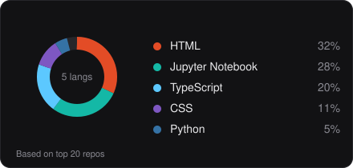

<h1 align="center">Manav Sharma</h1>

<h3 align="center">Data Analyst & Full-Stack Developer | Turning raw data into decisions</h3>

  

  
  
  
  

 

## **About Me**

Master's student at IIT Patna, learning data analytics by building things instead of just watching tutorials. I code, I struggle, I break things, then I fix them, and somewhere in that loop I end up shipping something that actually works.

I like data products that go all the way: statistical anomaly detection, clean pipelines, dashboards people actually use, and a full-stack wrapper when the project needs one. Honest statistics over naive 3σ shortcuts, and things that keep working even when the AI layer doesn't.

 

## **Core Technologies**

<table>
<tr>
<td width="50%" valign="top">

<b>Data & Analytics</b>

<b>Full-Stack & Tools</b>

</td>
<td width="50%" valign="middle" align="center">

</td>
</tr>
</table>

 

## **Featured Projects**

<table>
  <tr>
    <td width="33%" valign="top">
      <h4>Anomalyze</h4>
      
<i>AI anomaly detection for any CSV or Excel file</i>

      
Upload a file, get auto-inferred schemas, statistical profiling, and a dual-mode anomaly engine (MAD robust-z + Tukey IQR) that resists extreme outliers. 83 passing tests, 0 accessibility violations.

      
Next.js · TypeScript · Gemini API · Recharts

      
<a href="https://anomalyze-khaki.vercel.app/">Live</a> · <a href="https://github.com/Man-av/Anomalyze">Repo</a>

    </td>
    <td width="33%" valign="top">
      <h4>Owner Finder</h4>
      
<i>QR-based vehicle owner contact</i>

      
Scan a QR sticker to reach a parked vehicle's owner without exposing phone numbers. Rate-limited plate verification blocks remote abuse, and the whole thing runs at zero cost.

      
Supabase (RLS) · Next.js · React · Vercel

      
<a href="https://ownerfinder.vercel.app/">Live</a> · <a href="https://github.com/Man-av/OwnerFinder">Repo</a>

    </td>
    <td width="33%" valign="top">
      <h4>Customer Sales Dashboard</h4>
      
<i>Multi-year sales analytics in Power BI</i>

      
Interactive regional sales views with DAX measures isolating profit margin trends and top customer cohorts, built to inform inventory and distribution decisions.

      
Power BI · DAX · SQL · Excel

      
<a href="https://app.powerbi.com/view?r=eyJrIjoiYmI0NDgyYzAtNTk2YS00NTAxLTkzYmUtODM2OTk0ODUxNDlhIiwidCI6ImYwYTdmMzFiLWJlNDgtNGM2OS1iMTVmLThhMzZhOGEwYzNiMyJ9&pageName=a64b7470034ca0e298d0">Live</a> · <a href="https://github.com/Man-av/customer-sales-analysis">Repo</a>

    </td>
  </tr>
</table>

<a href="https://sharmanav.vercel.app/#projects">More projects on my portfolio</a>

 

## **Certifications**

- **Data Analytics Virtual Internship**, Deloitte (Forage), Jun 2025
- **Python for Data Science**, NPTEL (IIT Madras), Jul to Aug 2024
- **Database Management System**, NPTEL (IIT Madras), Jul to Sep 2025

 

## **GitHub Stats**

  

  

 

## **Contribution Snake**

  <picture>
    <source media="(prefers-color-scheme: dark)"
            srcset="https://raw.githubusercontent.com/Man-av/Man-av/output/github-contribution-grid-snake-dark.svg">
    <source media="(prefers-color-scheme: light)"
            srcset="https://raw.githubusercontent.com/Man-av/Man-av/output/github-contribution-grid-snake.svg">
    
  </picture>

 

## **Connect With Me**

  
  
  
  

  <i>Open to Data Analyst, BI, and entry-level Data Science roles</i>

